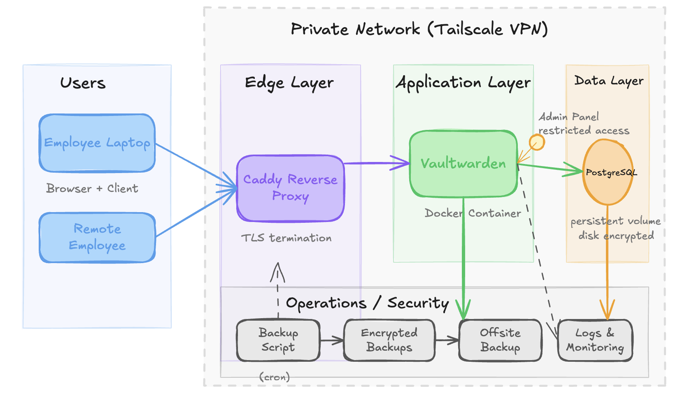
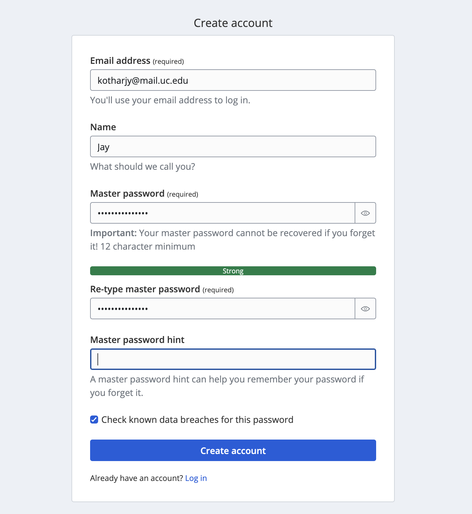
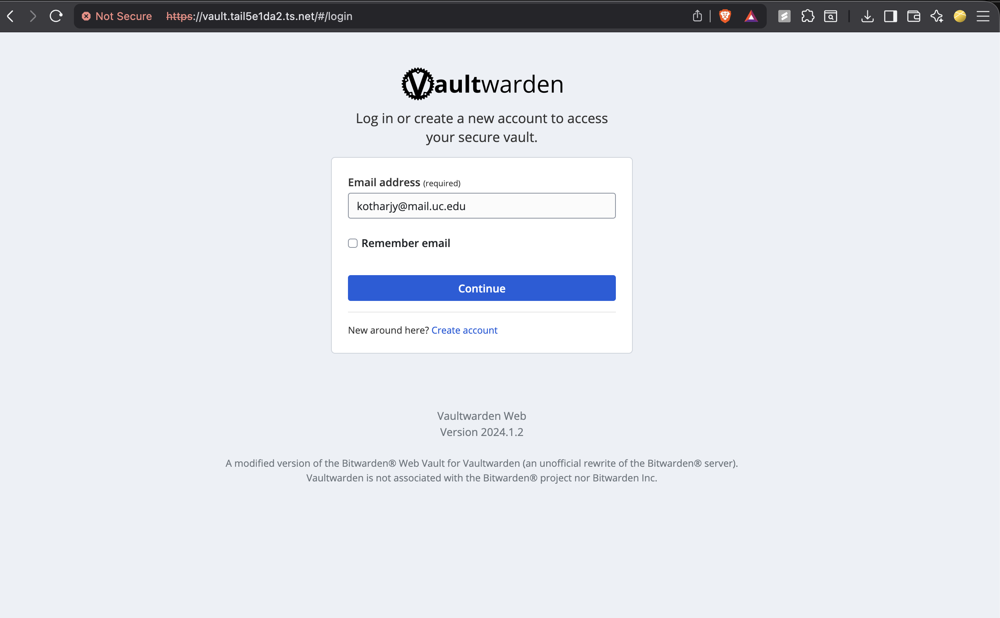
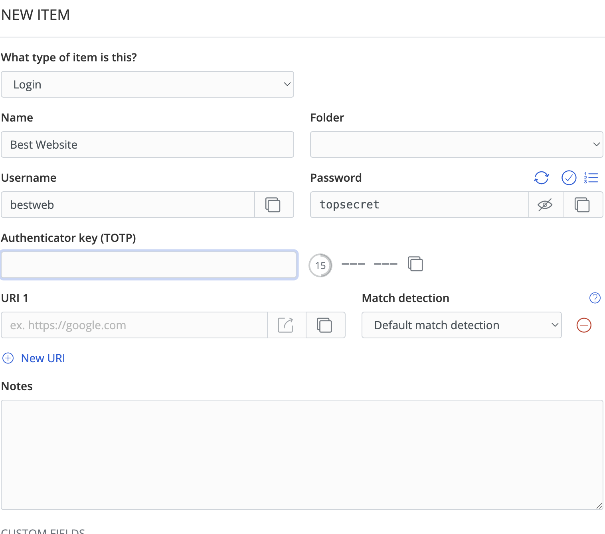
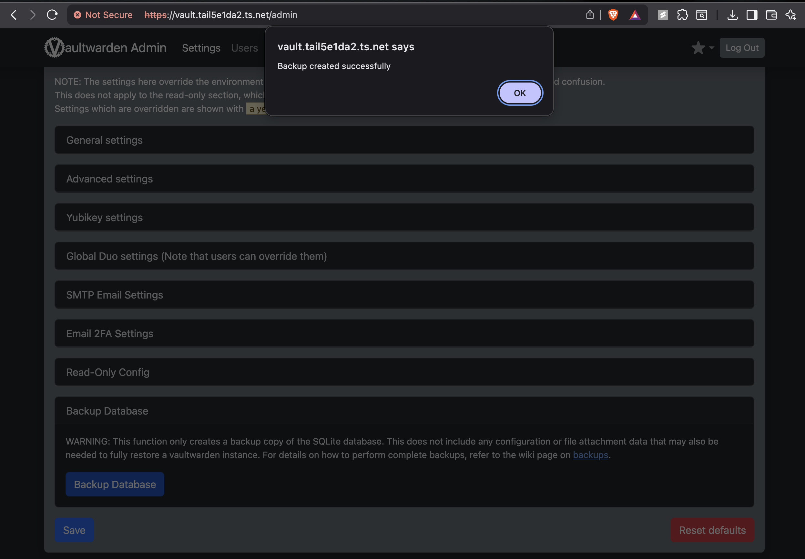
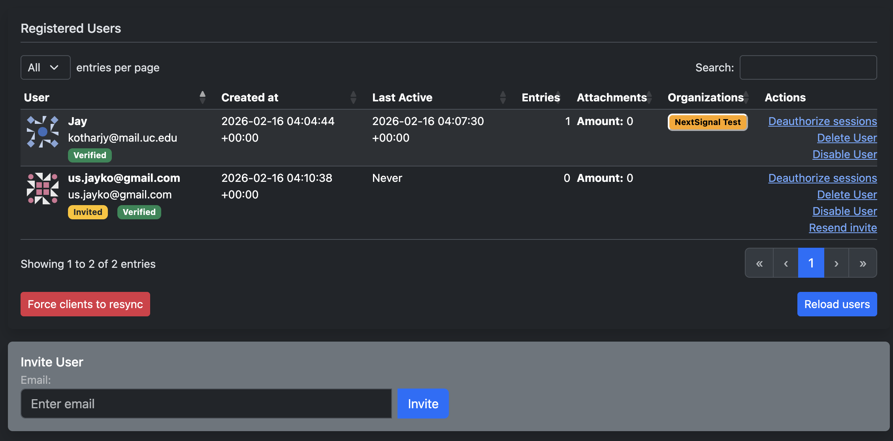
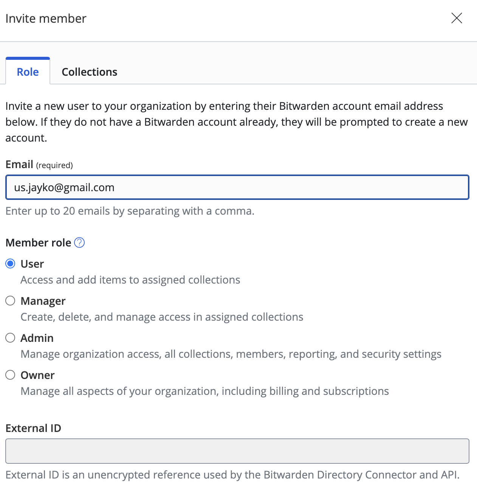
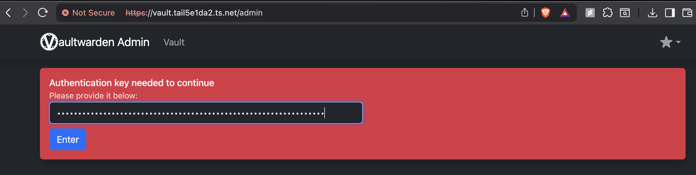
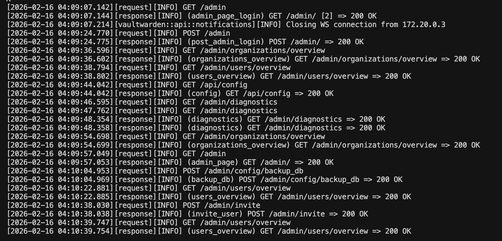
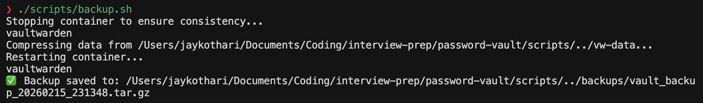

# Password Vault Design

A system design for an enterprise password vault based on the [Password Vault Challenge](Password%20Vault%20Challenge.pdf).

## Table of Contents
- [Requirements](#requirements)
- [Build vs Buy Decision](#build-vs-buy-decision)
- [Tool Comparison](#tool-comparison)
- [Selected Solution: Vaultwarden](#selected-solution-vaultwarden)
- [Architecture and Deployment](#architecture-and-deployment)
- [Demo](#demo)
- [Security Hardening](#security-hardening)
- [Backup and Recovery](#backup-and-recovery)
- [Access Control and Offboarding](#access-control-and-offboarding)
- [SOC2 Alignment](#soc2-alignment)
- [Trade-offs and Future Improvements](#trade-offs-and-future-improvement)

---

## Requirements

### Functional Requirements
1. RBAC — Role Based Access Control
2. Secret vault sharing
3. MFA support
4. Audit logs
5. Backup strategy
6. HA — High Availability
7. Admin controls
8. Offboarding process
9. Compliance (SOC2 controls)

### Non-functional Requirements
- Availability and Reliability
- Scalable
- Maintainable

---

## Build vs Buy Decision

Working with something as sensitive as password management, there are many active attack vectors that make building and managing our own password management tool unwise.

Instead, to satisfy the **"free for life"** requirement, we use an existing open source tool and adapt it to our use case.

---

## Tool Comparison

With requirements defined, we evaluated tools that satisfy them.

> I used AI to quickly list out some options and rank them, then manually verified the top 3.

---

## Selected Solution: Vaultwarden

Vaultwarden stood out because:
1. It satisfies all our functional requirements
2. It has been battle-tested by many organizations
3. It has extensive support and community

---

## Architecture and Deployment

Self-hosted behind a VPN (Tailscale or similar). VPN reduces internet attack surface vs exposing login endpoint publicly.

### Deployment Strategy
- **Docker Compose**
  - Caddy for automatic TLS
  - Vaultwarden container
  - Postgres container (optional; SQLite used for PoC)

See [demo/SETUP.md](demo/SETUP.md) for setup instructions.

---

## Demo

### UI Overview

| Create Account | Home / Vault | Add New Password |
|----------------|--------------|------------------|
|  |  |  |

### Admin Interface

Vaultwarden provides an admin panel for user management, RBAC, and configuration:

| User management | RBAC / Collections | Master key (emergency access) |
|-----------------|--------------------|-------------------------------|
|  |  |  |

### Audit and Operations

| Access logs (Caddy) | Docker logs | Backup script |
|--------------------|-------------|---------------|
|  |  |  |

---

## Security Hardening
- Network firewall rules
- Log retention
- Enforce 2FA
- Password policy
- Disable admin interface after setup

---

## Backup and Recovery

A `backup.sh` script creates consistent backups by:
1. Stopping the Vaultwarden container
2. Compressing `vw-data/` to a timestamped `.tar.gz`
3. Restarting the container
4. Optional retention: deletes backups older than 30 days

In production, this would run on a cron schedule.

---

## SOC2 Alignment

SOC2 is about controls.

| Control | How architecture supports it |
|---------|-----------------------------|
| Access control | RBAC + MFA |
| Encryption | Client-side AES-256 |
| Logging | Docker and Access logs |
| Backup | `backup.sh` + cron |
| Change management | pin version in docker-compose |
| Availability | Postgres HA in production |

---

## Disaster Control and Recovery

- Provision new server
- Install Docker
- Pull same Vaultwarden version
- Restore vw-data/
- Start container
- Verify login
- Rotate admin token

A detailed guide can be found here [Backing Up your Vault](https://github.com/dani-garcia/vaultwarden/wiki/Backing-up-your-vault)

---

## Trade-offs and Future Improvement

- Migrate from SQLite to Postgres for production HA
- Document offboarding and access revocation procedures
- Save admin master key physically in case of a "broken-glass" scenario
- Add operational runbook with instructions on how to perform basic tasks
